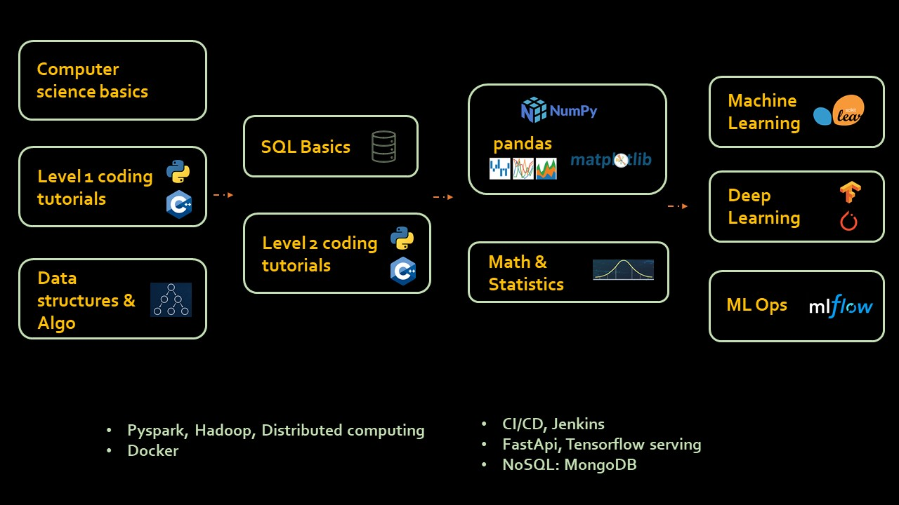

# Step by step roadmap for machine learning engineer

Below is the step by step process of how you can start with zero knowledge and learn skills required to become machine learning engineer. Note that this will setup a solid base for you and after this 6 months journey you need to work on many projects and acquire additional knowledge to qualify as a machine learning engineer. 

Week 1, 2, 3, 4 
===============

### Computer Science Principals

Program or code runs on a computer and uses CPU,RAM, input/output devices. This khan academy course goes over all these basic principals of computer science. Data is stored as bits (1s and 0s) in RAM and disk. The course will also go over fundamentals of binary numbers. **In this course only follow first 4 sections (1) Digital Information (2) The Internet (3) Programming (4) Algorithms** Completing remaining sections is optional and do it if you have time and interest.

https://www.khanacademy.org/computing/ap-computer-science-principles/computers-101

At this stage you are ready to write your first program and explore coding tutorials. The idea is to get basic understanding
of programming such as variables, data types, file operation etc.
 
### Level 1 Coding Tutorials
For python, I've build a tutorial playlist for absolute beginners. Watch **first 14** 
tutorails from this playlist. Remaining you can watch at a later stage.

Python playlist: https://www.youtube.com/playlist?list=PLeo1K3hjS3uv5U-Lmlnucd7gqF-3ehIh0

Also I've similar playlist in Hindi as well (just in case you are more comfortable with hindi language)

Python hindi tutorials: https://www.youtube.com/playlist?list=PLPbgcxheSpE1DJKfdko58_AIZRIT0TjpO

I've many interesting exercises and their solutions at this place: https://github.com/codebasics/py/tree/master/Basics/Hindi
(The folder name is hindi but exercise is for both hindi and english tutorials)

### Data Structures & Algorithms

There is not a single programming interview where they don't ask about data structures and algorithms (a.k.a DSA). DSA are
fundamental building blocks of any program (doesn't matter which programming language). Follow this playlist 
to get your data structure and algo concepts clear.

Data structures and algo playlist: https://www.youtube.com/playlist?list=PLeo1K3hjS3uu_n_a__MI_KktGTLYopZ12

Week 5, 6 
=========

### SQL Basics

Doesn't matter which career track you choose, you need to have good understanding of relational databases 
and SQL (structured query language). Here are some course links for SQL.

SQL basics on khan academy: https://www.khanacademy.org/computing/computer-programming/sql

Kudavenkat SQL playlist (watch first 12 videos): https://www.youtube.com/playlist?list=PL08903FB7ACA1C2FB

For kudavenkat playlist above, if you are interested in going little more deeper into SQL then you can 
watch tutorials beyond # 12.

Week 7, 8 
=========
### Level 2 Coding Tutorials

At this stage, now you know some basic coding, data structures, SQL etc. You can now go through intermediate 
coding tutorials. Here are some online resources for the same,

Codebasics python tutorials (tutorial # 15 to # 27): https://www.youtube.com/playlist?list=PLeo1K3hjS3uv5U-Lmlnucd7gqF-3ehIh0

Week 9, 10, 11, 12: Numpy, Pandas, Data Visualization Libraries  
================================================================
* NumPy and Pandas
	- Codebasics Numpy playlist: https://www.youtube.com/playlist?list=PLeo1K3hjS3uset9zIVzJWqplaWBiacTEU
	- Codebasics pandas playlist (first 9): https://www.youtube.com/playlist?list=PLeo1K3hjS3uuASpe-1LjfG5f14Bnozjwy

* Visualization library
	- Matplotlib: codebasics matplotlib playlist: https://www.youtube.com/playlist?list=PLeo1K3hjS3uu4Lr8_kro2AqaO6CFYgKOl
	
* Kaggle exploratory data analysis
	- Notebooks: https://www.kaggle.com/code
	- Datasets: https://www.kaggle.com/datasets

Week 13, 14: Math, Statistics For Machine Learning  
======================================================
* Math and Statistics for data science
    - Codebasics playlist: https://www.youtube.com/playlist?list=PLeo1K3hjS3uuKaU2nBDwr6zrSOTzNCs0l
    - Statistics book: Practical Statistics for Data Scientists: 50+ Essential Concepts Using R and Python by Peter Bruce, Andrew Bruce
    
Week 15, 16, 17, 18: Machine Learning
=====================================

* Machine learning
	- codebasics ml playlist (first 17): https://www.youtube.com/playlist?list=PLeo1K3hjS3uvCeTYTeyfe0-rN5r8zn9rw
	- data science regression project: same playlist as above. Tutorial 18 to 25
	- HINDI codebasics ml playlist (first 14): https://www.youtube.com/playlist?list=PLPbgcxheSpE0aBsefANDYe2X_-tyJbBMr
	 
Week 19, 20, 21, 22: Deep Learning
==================================

* Deep learning	 (artificial neural network, convolutional neural network, recurrent neural network) 
  - codebasics deep learning playlist: https://www.youtube.com/playlist?list=PLeo1K3hjS3uu7CxAacxVndI4bE_o3BDtO
  
Week 23, 24: ML Ops
====================
You need to learn atleast one Machine Learning Life Cycle tool. MLFlow is one such opensource tool. Please practice tutorials on mlflow official website to get a feel of how these tools can automate machine learning life cycle.
https://www.mlflow.org/docs/latest/tutorials-and-examples/index.html#

Additional skills that will be helpful
=======================================
* Pyspark, Hadoop, Distributed Computing
* Docker 
* CI (Continuous Integration) & CD (Continuous Delivery) fundamentals, Jenkins
* Version control using Git
* FastApi, Tensorflow serving: To build http servers around the trained models
* NoSQL databases such as MongoDB

Useful Tips
===========

### Understanding principals of effective learning

Please watch this video to understand how you can learn effectively so that you can get maximum output by investing minimum amount of time.

https://www.youtube.com/watch?v=yZFrSDjRvjk

### Group Study

Group study is always better than studying alone. If you know someone who wants to learn coding as well then make a group and start studying together. Also hold each other accountable and discuss learning milestones with each other. You can join codebasics discord server to find partners for group study.

Discord link: https://discord.gg/r42Kbuk  <-- On this you will find a partner finder channel where you can find similar minded people with whom you can do a group study

### Following discipline and not giving up

Learning coding, especially when you are new, can get frustrating at times. Every good programmer has gone through this pain so if you are facing issues, don't start thinking you are not smart and coding is not your thing. You need to have lot of patience. When you come from non coding background, thinking in terms of coding is a big shift in the mind paradigm hence it can take some time before it starts clicking you.

